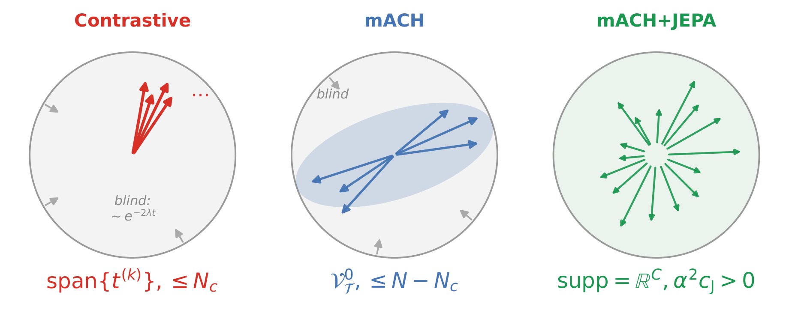
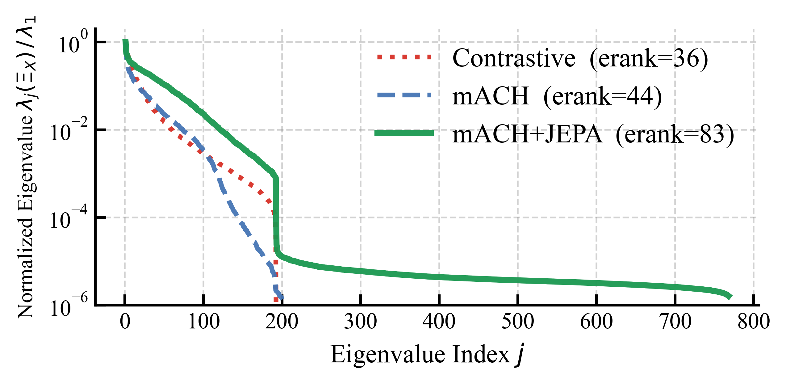
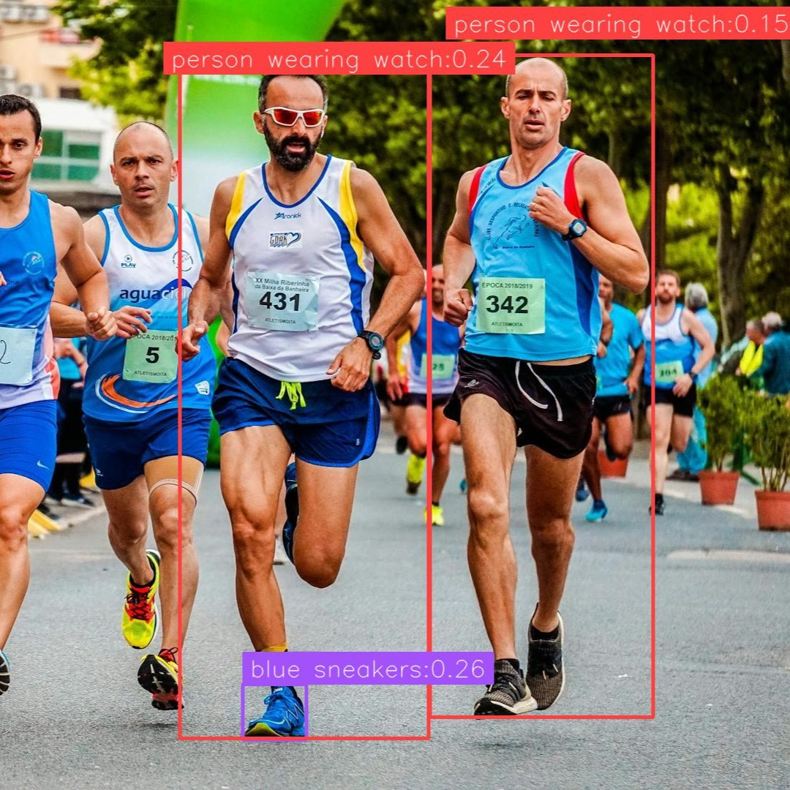
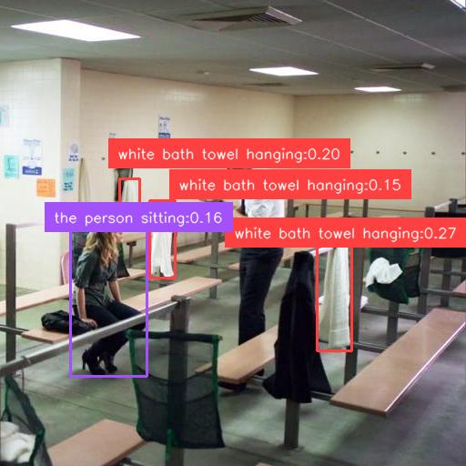
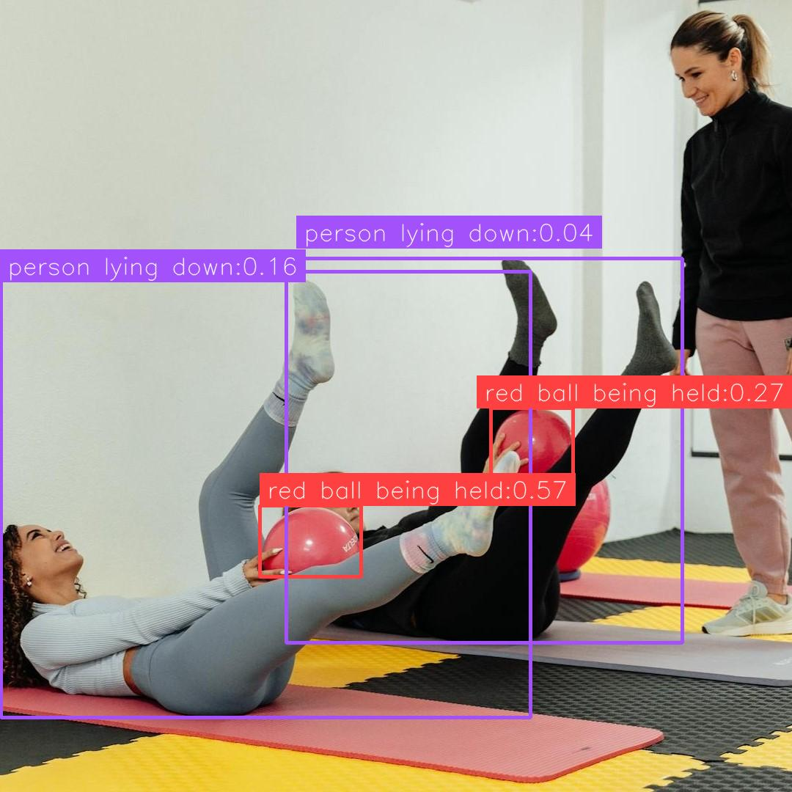
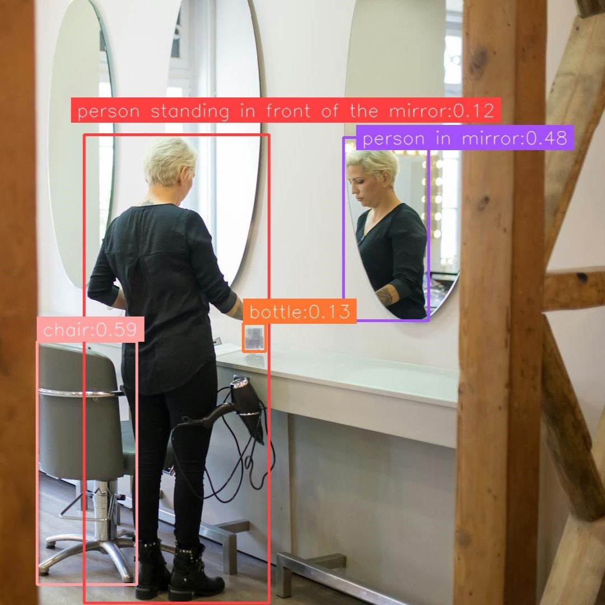

# Scaling Representation Diversity: Modulated Attention and Reconstructive Regularization for Visual Grounding

[](https://www.python.org/downloads/)
[](https://pytorch.org/)
[](https://arxiv.org/abs/2608.12748)
[](https://huggingface.co/datasets/EndlessnessSoul/Objects365_captions)

Official implementation for **[Scaling Representation Diversity: Modulated Attention and Reconstructive Regularization for Visual Grounding](https://arxiv.org/abs/2608.12748)**.

- **Code**: [https://github.com/inlmouse/MACH](https://github.com/inlmouse/MACH)
- **Dataset (O365-Caption)**: [https://huggingface.co/datasets/EndlessnessSoul/Objects365_captions](https://huggingface.co/datasets/EndlessnessSoul/Objects365_captions)

## Overview

We revisit Referring Expression Comprehension (REC) from the perspective of **unified open-vocabulary grounding** and identify **representation degeneration** — contrastive objectives collapsing features into low-rank subspaces — as a key obstacle to scaling a single generalist model. To preserve representation diversity, we propose a holistic **data–model co-design** framework:

- **Modulated Attention-Contrastive Head (mACH)**: a lightweight, broadcast-based token-level cross-attention head. A single visual forward pass simultaneously interacts with an arbitrary number of referring expressions, enabling efficient multi-query grounding. Architecture-agnostic — implemented for both CNN (`expalignet`) and RT-DETR-style (`vltrdetrnet`) detectors.
- **Text-conditioned JEPA auxiliary stream**: an EMA teacher–student branch that reconstructs masked visual features under language guidance, supplying complementary gradient support beyond the discriminative objective. **Discarded after training — zero inference overhead.**
- **Objects365-Caption (O365-Caption)**: Objects365 enriched with 9.6M dense, context-aware referring expressions (638K images) via a three-stage MLLM pipeline (Qwen3-VL-2B category disambiguation → Qwen3-VL-32B captioning → cross-lingual translation).
- **Theoretical analysis**: the gradient subspaces of contrastive, mACH, and mACH+JEPA objectives form a strictly increasing ladder `Nc < N − Nc < C`; only the dual-stream objective is almost surely free of alignment-blind directions.

### Why the Dual-Stream Objective? A Theoretical View

<p align="center">
  
</p>

Grounding requires the score map to vary across spatial positions — a flat score map carries no localization signal. Since the attention logit `a_m = x_mᵀk` is linear in the visual token, the discriminative signal carried by a text direction `k` is exactly the spatial variance of its logits. We formalize this as the **directional alignment capacity** `cap(k) = Var_m(x_mᵀk) = kᵀΞ_X k`, where `Ξ_X` is the visual-token covariance. Directions with `cap(k) = 0` form the **alignment-blind subspace**: any expression whose keys land there produces position-independent attention and cannot be grounded.

Under weight decay, capacity is not a static property — directional variance decays as `~e^(−2λt)` unless continuously sustained by gradient signal. Each objective therefore preserves only the subspace its gradients span, and the three objectives form a strictly increasing ladder (with `Nc` expressions per image, `N` total text tokens, feature dim `C`):

- **Contrastive**: gradients live in the span of `Nc` pooled expression vectors — dim ≤ `Nc`.
- **mACH**: token-level attention expands supervision to the centered token subspace (softmax invariance removes one common-mode direction per expression) — dim ≤ `N − Nc`.
- **mACH + JEPA**: the auxiliary reconstructive stream is driven by text-free EMA targets, and its mask-resampling fluctuation yields a full-support spectral floor `α²c_J > 0` — the gradient field reaches **every** direction, dim = `C` almost surely.

Only the dual-stream objective is almost surely free of alignment-blind directions, and out-of-distribution expressions whose keys fall outside the training subspace retain positive capacity (Theorem 8 & Corollaries 9–10 in the paper).

This prediction is directly visible in the **eigenspectrum** of the empirical feature covariance `Ξ_X`, estimated from the shared visual tokens of all RefCOCOg-val images:

<p align="center">
  
</p>

Contrastive and mACH exhibit an identical spectral cliff around `j ≈ 200`, beyond which eigenvalues fall below the float32 accumulation floor — feature variation is confined to the language-conditioned subspace. mACH+JEPA instead retains a non-vanishing spectral tail across all 768 dimensions, matching the predicted spectral floor. Summarizing each spectrum by its **effective rank** gives a monotonic increase — 36 (Contrastive) → 44 (mACH) → **83** (mACH+JEPA) — confirming progressively richer representation diversity under the dual-stream objective.

### Key Results (Top-1 accuracy %, single 75M checkpoint, 640×640 input)

Zero-shot **unified generalist** evaluation (no benchmark-specific fine-tuning), on the cleaned "reviewed" RefCOCO splits:

| Method | #Params | RefCOCO val / testA / testB | RefCOCO+ val / testA / testB | RefCOCOg val / test |
|--------|---------|------------------------------|-------------------------------|----------------------|
| GDINO-T | 172M | 74.0 / 74.9 / 59.3 | 66.8 / 69.9 / 56.1 | 71.1 / 72.1 |
| GSVA | 7B | 86.3 / 89.2 / 83.8 | 72.8 / 78.8 / 68.0 | 81.6 / 81.8 |
| **Ours** | **75M** | **85.3 / 89.0 / 82.5** | **71.8 / 78.2 / 62.7** | **76.3 / 75.8** |

After benchmark-specific fine-tuning: **91.7 / 93.0 / 90.2** (RefCOCO), **83.5 / 87.5 / 76.9** (RefCOCO+), **85.1 / 86.0** (RefCOCOg) — outperforming fine-tuned GDINO-T and PropVG with far fewer parameters.

### Qualitative Results

Zero-shot grounding with the unified checkpoint (no benchmark-specific fine-tuning). Text queries and predicted boxes are rendered in matching colors:

<p align="center">
  
  <br>
  <em>(a) "person wearing watch" · "blue sneakers"</em> &nbsp;&nbsp;&nbsp;&nbsp;&nbsp;&nbsp;&nbsp;&nbsp;&nbsp;&nbsp;&nbsp;&nbsp;&nbsp;&nbsp;&nbsp;&nbsp; <em>(b) "the person sitting" · "white bath towel hanging"</em><br>
  
  <br>
  <em>(c) "person lying down" · "red ball being held"</em> &nbsp;&nbsp;&nbsp;&nbsp;&nbsp;&nbsp;&nbsp;&nbsp;&nbsp;&nbsp;&nbsp;&nbsp;&nbsp;&nbsp; <em>(d) "person standing in front of the mirror" · "person in mirror"</em>
</p>

The model grounds fine-grained attributes (watch, blue sneakers), relational descriptions (person in mirror vs. standing in front of it), and group/state queries (person lying down) — all from a single static checkpoint.

### Inference Efficiency (single NVIDIA V100)

| Setting | Latency | Peak VRAM |
|---------|---------|-----------|
| Fixed text (cached text embeddings) | **33.2 ms/img** | ~1.4 GB |
| Dynamic text (on-the-fly text encoder) | 140.5 ms/img | ~3.4 GB |

## Trained Checkpoints

| Checkpoint | Backbone | Text Encoder | Input | Download |
|------------|----------|--------------|-------|----------|
| `model_ach-woffn-rmjepa-epoch30.pth` | DINOv3 ConvNeXt-Tiny | Qwen3-VL-Embedding-2B (768) | 640×640 | [Google Drive](https://drive.google.com/file/d/1vr0rfQaq2ic4sUBZ2OZ2xYO2tFa4vHVr/view?usp=sharing) |

**Download via CLI:**
```bash
pip install gdown
gdown 1vr0rfQaq2ic4sUBZ2OZ2xYO2tFa4vHVr -O outputs-qwen2b-768/model_ach-woffn-rmjepa-epoch30.pth
```

To run inference with this checkpoint, set `CKPT_PATH` in `test.py`:

```python
CKPT_PATH = "outputs-qwen2b-768/model_ach-woffn-rmjepa-epoch30.pth"
```

## Installation

### Prerequisites

- Python >= 3.11
- CUDA-capable GPU (required in practice)

### Setup

```bash
# Clone the repository
git clone https://github.com/inlmouse/MACH.git
cd MACH

# One-shot setup (installs uv, runs uv sync, installs flash-attn, verifies)
bash scripts/setup_environment.sh
```

Or manually:

```bash
# Install uv package manager
curl -LsSf https://astral.sh/uv/install.sh | sh

# Create virtual environment and install dependencies
uv sync

# Install flash-attn separately (a prebuilt wheel is included in the repo root)
uv pip install ./flash_attn-2.8.3+cu12torch2.8cxx11abiFALSE-cp312-cp312-linux_x86_64.whl
# or build from source: uv pip install flash-attn --no-build-isolation

# Activate environment
source .venv/bin/activate
```

## Pretrained Weights

### DINOv3 ConvNeXt Backbone

DINOv3 provides ConvNeXt backbones pre-trained on the LVD-1689M dataset. ConvNeXt-Tiny is the default backbone.

| Model | Parameters | HuggingFace | ModelScope |
|-------|------------|-------------|------------|
| ConvNeXt Tiny | 29M | [Download](https://huggingface.co/facebook/dinov3-convnext-tiny-pretrain-lvd1689m) | [Download](https://modelscope.cn/models/facebook/dinov3-convnext-tiny-pretrain-lvd1689m) |
| ConvNeXt Small | 50M | [Download](https://huggingface.co/facebook/dinov3-convnext-small-pretrain-lvd1689m) | [Download](https://modelscope.cn/models/facebook/dinov3-convnext-small-pretrain-lvd1689m) |
| ConvNeXt Base | 89M | [Download](https://huggingface.co/facebook/dinov3-convnext-base-pretrain-lvd1689m) | [Download](https://modelscope.cn/models/facebook/dinov3-convnext-base-pretrain-lvd1689m) |

**Download via HuggingFace CLI:**
```bash
pip install huggingface-hub

huggingface-cli download facebook/dinov3-convnext-tiny-pretrain-lvd1689m \
    --local-dir ./pretrained/dinov3-convnext-tiny
```

**Download via ModelScope (China mainland):**
```bash
pip install modelscope

modelscope download --model facebook/dinov3-convnext-tiny-pretrain-lvd1689m \
    --local_dir ./pretrained/dinov3-convnext-tiny
```

**Note:** Some DINOv3 weights require accepting the license on HuggingFace before download.

### Qwen3-VL-Embedding Text Encoder (default)

The frozen **Qwen3-VL-Embedding-2B** is the language encoder used in the paper. Its 2048-dim outputs are truncated to `text_embed_dim` (768 for Tiny/Small, 1024 for Base) via Matryoshka Representation Learning (MRL) truncation.

| Model | Size | Embedding Dim | HuggingFace | ModelScope |
|-------|------|---------------|-------------|------------|
| Qwen3-VL-Embedding-2B | 2B | 2048 (MRL: 64-2048) | [Download](https://huggingface.co/Qwen/Qwen3-VL-Embedding-2B) | [Download](https://modelscope.cn/models/qwen/Qwen3-VL-Embedding-2B) |

```bash
# HuggingFace
huggingface-cli download Qwen/Qwen3-VL-Embedding-2B \
    --local-dir ./pretrained/Qwen3-VL-Embedding-2B

# ModelScope (China mainland)
modelscope download --model qwen/Qwen3-VL-Embedding-2B \
    --local_dir ./pretrained/Qwen3-VL-Embedding-2B
```

**Usage:**
```python
from dataset.textmodelembedder import Qwen3VLEmbeddingTextEmbedder

text_encoder = Qwen3VLEmbeddingTextEmbedder(
    "./pretrained/Qwen3-VL-Embedding-2B",
    device="cuda",
    mrl_truncate=768  # Truncate 2048 -> 768
)
```

### CLIP Text Encoder (alternative)

OpenAI's CLIP ViT-L/14 (768-dim) is also supported as an alternative text encoder.

| Model | Embedding Dim | Download URL |
|-------|---------------|--------------|
| ViT-L/14 | 768 | [OpenAI Official](https://openaipublic.azureedge.net/clip/models/b8cca3fd41ae0c99ba7e8951adf17d267cdb84cd88be6f7c2e0eca1737a03836/ViT-L-14.pt) |

```bash
wget https://openaipublic.azureedge.net/clip/models/b8cca3fd41ae0c99ba7e8951adf17d267cdb84cd88be6f7c2e0eca1737a03836/ViT-L-14.pt \
    -O ./pretrained/ViT-L-14.pt
```

## Training

There are no config files or CLI arguments for training — edit the `TrainConfig` dataclass in `train_ddp.py`.

### Multi-GPU (DDP, recommended)

```bash
# Single-node multi-GPU
torchrun --nproc_per_node=8 train_ddp.py

# Multi-node multi-GPU
torchrun --nnodes=2 --nproc_per_node=4 --node_rank=0 \
    --master_addr="<master-ip>" --master_port=12345 train_ddp.py   # Node 0 (master)
torchrun --nnodes=2 --nproc_per_node=4 --node_rank=1 \
    --master_addr="<master-ip>" --master_port=12345 train_ddp.py   # Node 1
```

### Configuration

Edit `TrainConfig` in `train_ddp.py` (paper defaults shown):

```python
@dataclass
class TrainConfig:
    model_name = "expalignet"       # "expalignet" (CNN) | "vltrdetrnet" (RT-DETR variant)
    num_epochs: int = 30
    batch_size_per_gpu: int = 16
    num_workers: int = 4
    target_size: int = 640
    output_dir: str = "outputs-qwen2b-768"

    # Model configuration
    text_embed_dim: int = 768       # 768 (Tiny/Small), 1024 (Base)
    num_infonce_batch: int = 20     # Referring expressions sampled per image
    backbone_size: str = "tiny"     # tiny/small/base

    # Pretrained weights
    pretrain_backbone: str = "/path/to/dinov3_convnext_tiny_pretrain_lvd1689m.pth"
    pretrain_text_encoder: str = "/path/to/Qwen3-VL-Embedding-2B"

    # Optimizer (CNN variant: AdamW + cosine annealing)
    base_lr: float = 2e-3
    weight_decay: float = 0.025
    use_amp: bool = True

    # Dataset configuration
    train_ann_files = [
        "/path/to/Objects365_v1/annotations/objects365_train_with_caption.json",  # O365-Caption
        "/path/to/flickr30k/final_flickr_separateGT_train_segm.json",
        "/path/to/MixedGrounding/mdetr_annotations/final_mixed_train_no_coco_segm_fixed.json",  # GoldG-f
        # ...
    ]
```

Paper hyperparameters (Appendix E): AdamW (β₁=0.9, β₂=0.95), CNN variant — lr 2e-3, weight decay 0.025, cosine annealing, 3-epoch warmup, 30 epochs, FP16 AMP; DETR variant — lr 1e-4, weight decay 1e-4, step decay at 80%/90% milestones, 1-epoch warmup. JEPA auxiliary weight α = 0.1 (set in `loss/detectloss.py`). Trained on 8× NVIDIA RTX PRO 6000 (96 GB).

### DDP Features

- **Automatic dataset caching**: main process builds the dataset and caches samples + caption embeddings; other ranks load from cache
- **Synchronized training**: gradient synchronization across all GPUs
- **Per-epoch validation**: RefCOCO (reviewed) online evaluation on rank 0
- **Automatic checkpointing**: saves `model_last.pth` (latest) and `model_best.pth` (best accuracy) into `output_dir`

### Resuming Training

```python
pretrain_model_path = "outputs-qwen2b-768/model_last.pth"
resume: bool = True   # restores optimizer state and epoch; False = fine-tune with fresh optimizer
```

## Inference

### Single-image inference + visualization

```bash
uv run python test.py
```

Configure constants at the top of `test.py` (checkpoint path, image path/dir, thresholds, text encoder type); results are written to `test_results/`.

The text encoder is only needed once per class set: encode your class names / referring expressions with `embedtext()`, then pass the features to `model.predict()` (or `model.forward`) for any number of images. With cached text embeddings the visual stream runs at ~33 ms/img (see Inference Efficiency above).

## Evaluation

### RefCOCO/+/g (reviewed splits)

```bash
uv run python evaluation/refcoco_reviewed_offline_evaluator.py
```

Edit the constants at the top of the script (`CKPT_PATH`, `QWEN_MODEL_PATH`, dataset paths, thresholds). A prediction is correct if IoU with the ground-truth box > 0.5; Top-1 accuracy is reported. `evaluation/refcoco_reviewed_online_evaluator.py` is used inside `train_ddp.py` for per-epoch validation.


## Project Structure

```
.
├── train_ddp.py              # DDP training entry (TrainConfig, wandb, caching)
├── test.py                   # Inference and visualization
├── models/
│   ├── builder.py            # build_model() factory: 'expalignet' | 'vltrdetrnet'
│   ├── convnext.py           # DINOv3 ConvNeXt backbone
│   ├── expalignet.py         # CNN variant: ConvNeXt + FPANeck + mACH head
│   └── vltrdetrnet.py        # DETR variant: ConvNeXt + FPANeck + VL-RT-DETR decoder
├── layers/
│   ├── fpn.py                # FPN+PAN neck
│   ├── head.py               # Detect head + ModulatedAttentionContrastiveHead (mACH)
│   ├── jepa.py               # AuxMultimodalJEPABranch (text-conditioned JEPA auxiliary stream)
│   ├── detrhead.py           # RT-DETR deformable decoder
│   └── vldetrhead.py         # VL-RT-DETR decoder with text-conditioned heads
├── loss/
│   ├── detectloss.py         # Detection loss (CIoU + DFL + BCE + JEPA aux, alpha=0.1)
│   ├── dertloss.py           # RT-DETR loss (Varifocal + Hungarian matching)
│   └── taskalignedassigner.py
├── dataset/
│   ├── unified_dataset.py    # Per-image expression subsampling + negative padding
│   ├── build_dataloader.py   # Dataloader builder and annotation remapping
│   ├── transforms.py         # Data augmentation
│   ├── textmodelembedder.py  # Qwen3-VL-Embedding / CLIP text encoder wrappers
│   └── parsers/              # Unified annotation parsers (COCO-style)
├── evaluation/
│   ├── refcoco_reviewed_offline_evaluator.py  # RefCOCO (reviewed) offline eval
│   ├── refcoco_reviewed_online_evaluator.py   # Per-epoch validation in DDP training
│   ├── coco_evaluator.py
│   └── lvis_offline_evaluator.py
├── utils/                    # Training utils, NMS/box ops, visualization
└── third_party/Qwen3_VL_Embedding/  # Vendored Qwen3-VL embedder
```

## Limitations

We believe honest reporting matters more than inflated claims. The main limitation of this work (also discussed in Appendix F of the paper):

- **Low confidence on unfamiliar samples.** The dual-stream objective preserves *representational* capacity — out-of-distribution expressions remain alignment-active in the feature space — but it does not by itself calibrate detection scores. In practice, objects from novel categories or unusual domains often receive **conservative, low-confidence predictions** even when the localization is correct. You may need a lower confidence threshold (e.g. `0.05` instead of `0.25`) for open-world queries, and score distributions can shift across domains. Confidence calibration and open-set score estimation are important directions for future work.
- **Theory covers representation, not end-task accuracy.** The directional alignment capacity analysis characterizes *which semantic directions remain available* for vision-language alignment; it does not account for optimization dynamics, supervision quality, or score calibration, all of which also affect empirical performance.

## Citation

```bibtex
@article{hu2026mach,
  title={Scaling Representation Diversity: Modulated Attention and Reconstructive Regularization for Visual Grounding},
  author={Hu, Junyi and Bai, Tian and Wu, Fengyi and Huang, Yian and Wen, Wei and Li, Zaoli and Lin, Junli and Li, Xingchen and Peng, Zhenming and Zhang, Yi},
  journal={arXiv preprint arXiv:2608.12748},
  year={2026}
}
```

## License

This project is licensed under the MIT License.

## Acknowledgements

- [DINOv3](https://github.com/facebookresearch/dinov3) for ConvNeXt pre-trained weights
- [Qwen3-VL](https://github.com/QwenLM/Qwen3-VL) for vision-language embeddings
- [CLIP](https://github.com/openai/CLIP) for text encoding
- [FlashAttention](https://github.com/Dao-AILab/flash-attention) for efficient variable-length attention
- [LVIS API](https://github.com/lvis-dataset/lvis-api) for evaluation
